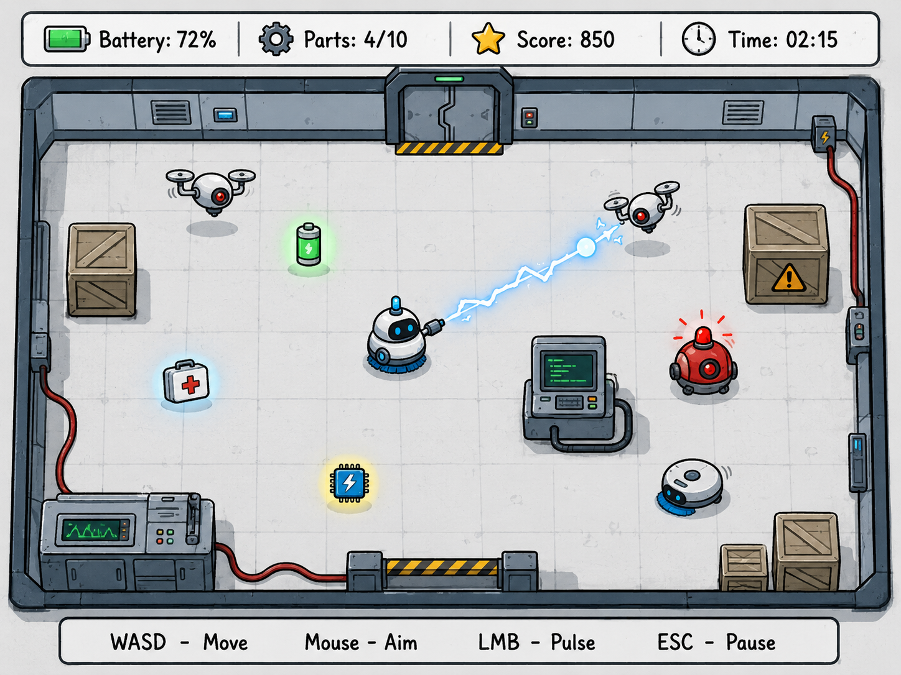
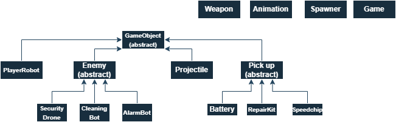

# Robo Cleaner: Lab Escape

## Short description

The player controls a small cleaning robot trapped inside a laboratory after after the destruction of the laboratory. During the game, different hostile robots and security drones appear in the room and move toward the player. The player must avoid enemies, shoot electric projectiles, collect useful items, and survive as long as possible. The game takes place in one laboratory arena, so the main focus is on movement, shooting, enemy behaviour, collision detection, and a simple score and upgrade system.

---

## Main elements

- **Character:** one player-controlled cleaning robot
- **Enemies:** security drone, cleaning bot, alarm bot
- **Weapon:** electric pulse shooter
- **Bonuses:** battery, repair kit, speed chip
- **Gameplay:** survive enemy waves, avoid enemies, shoot projectiles, collect items, gain points
- **Controls:** WASD / arrows to move, mouse to aim, left mouse button to shoot, Esc to pause

---

## Functionalities

- Character movement
- Mouse aiming
- Shooting electric projectiles
- Enemy spawning during the game
- Basic enemy
- Different enemy types with different speed and health
- Collision detection between player, enemies, projectiles, and pickups
- Battery / HP system for the player
- Damage system for enemies
- Item collection
- Score tracking and display
- Simple upgrade or bonus system
- Game over condition and restart option
- Simple UI for battery level, score, collected parts, and time
- Sound effects for shooting, enemy hits, and item collection
- Basic menu for starting and pausing the game

---

## Dummy screen

---

## Class diagram

